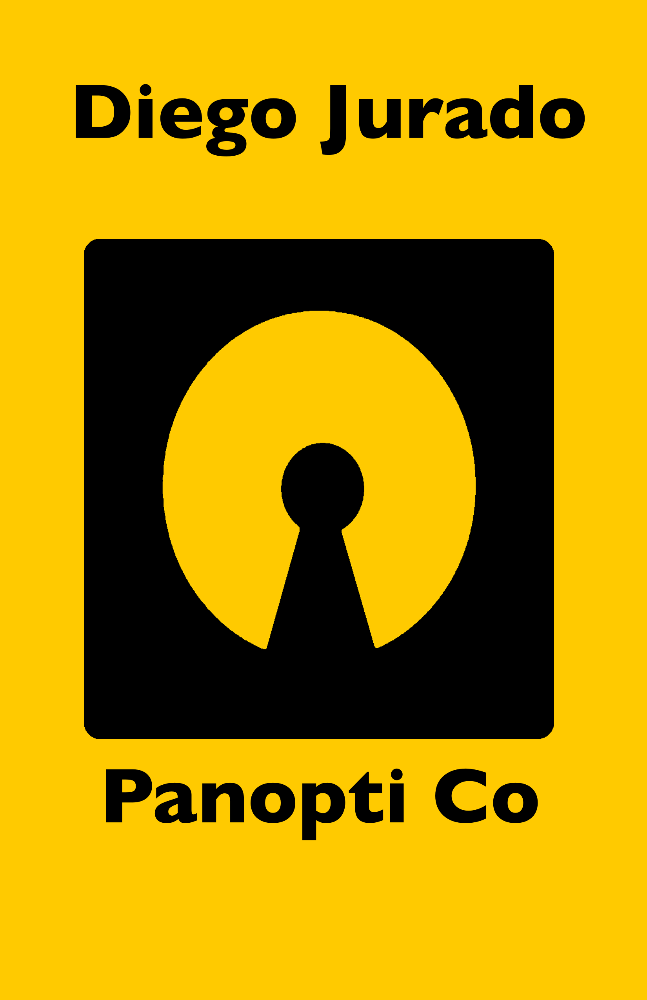

# Diego's Consolidation Unit Project

Goal: I want to produce a cover for the book I have composed for a different course this semester.

Baseline: 
- Completing the front cover
- Selecting and justifying fonts used
- Selecting and justifying colors used
- Compose an image that has different meanings in both positive and negative color contrasts

Aspirational
- Complete a book spine design
- Complete a back cover design

## Current Designs:

| Front | Back | Spine |
| --- | --- | --- |
| | | |

Justifications:

- Font:

- Color:
  - Yellow: I wanted to incorporate the color yellow into the cover, as it used throughout the stories in the book. It is used to call attention to people, expecially those in positions of power. Throughout the stories there is mention of people in yellow suits. Personally, I like books with yellow covers. Further, when the colors are inverted the image inside of the box looks yellow. In a sense we are now showing the people in yellow.
    - In Color Theory, yellow represents happiness, energy, and also deceit. In the universe of the story, it makes sense that the companies color is yellow to resemble the high-energy of a massive tech corporation. From a literary perspective, yellow seems to fall more into its deceitful role.
  - Black: I wanted to incorporate the color black into the cover, as it is the color of the factory workers. So, it resembles equality. Also, black looks good with most other colors, especially bright colors.
    - In Color Theory, black is commonly associated with power, elegance, and formality. On the other hand, it can also be associated with evil, death, and mystery. The use of black here thought, I believe, represents mystery for the reader first glancing at the book, and the metaphorical death of humans portrayed in the book.

- Image:

